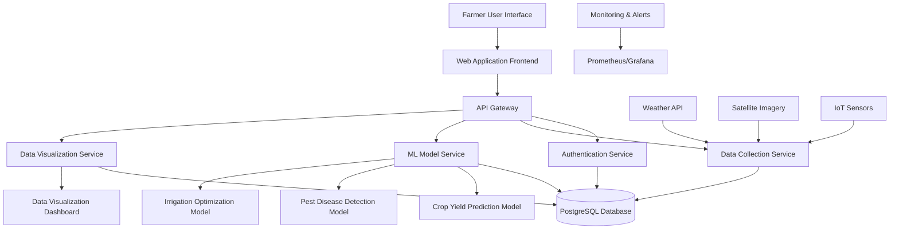

# AI Agriculture Application Architecture

## Overview

The AI Agriculture Application is designed to help farmers increase productivity while preserving the environment through data-driven insights and machine learning algorithms. The system consists of several interconnected components that work together to provide comprehensive agricultural intelligence.

## System Architecture

## Component Descriptions

### 1. Web Application Frontend
- Built with React.js for responsive, mobile-friendly interface
- Provides dashboards for farmers to view insights and recommendations
- Interactive forms for data input
- Real-time visualization of farm metrics

### 2. API Gateway
- FastAPI-based backend serving RESTful APIs
- Handles authentication and authorization
- Routes requests to appropriate microservices
- Provides automatic API documentation

### 3. Database Layer
- PostgreSQL database for structured data storage
- Stores farmer information, farm data, historical records
- TimescaleDB extension for time-series data (weather, soil readings)
- PostGIS for geospatial data

### 4. Machine Learning Services
- Crop yield prediction models
- Pest and disease detection using computer vision
- Irrigation optimization algorithms
- Soil health analysis models
- Market price forecasting

### 5. Data Collection Services
- Integration with weather APIs for hyperlocal forecasts
- Processing of satellite imagery for crop health monitoring
- IoT sensor data ingestion for real-time monitoring
- Manual data entry interfaces for farmers

### 6. Data Visualization
- Interactive dashboards for monitoring farm metrics
- Historical trend analysis
- Predictive visualization
- Environmental impact tracking

## Data Flow

1. **Data Collection**: 
   - Farmers input data through the web interface
   - IoT sensors automatically collect environmental data
   - Weather APIs provide forecast data
   - Satellite imagery is processed for crop health

2. **Data Storage**: 
   - All data is stored in PostgreSQL database
   - Time-series data is optimized with TimescaleDB
   - Geospatial data is handled with PostGIS

3. **Data Processing**: 
   - Raw data is cleaned and preprocessed
   - Feature engineering for machine learning models
   - Aggregation of historical data for analysis

4. **Machine Learning**: 
   - Models are trained on historical data
   - Real-time predictions are made based on current data
   - Recommendations are generated for farmers

5. **Visualization**: 
   - Dashboards display key metrics and insights
   - Predictive visualizations help with planning
   - Alerts are sent for critical issues

## Security Considerations

- End-to-end encryption for data transmission
- Role-based access control for user permissions
- Regular security audits and updates
- GDPR compliance for data privacy

## Scalability

- Microservices architecture for independent scaling
- Containerized deployment with Docker
- Load balancing for high availability
- Database sharding for large datasets

## Monitoring and Maintenance

- Prometheus for system metrics
- Grafana for visualization of system health
- Automated alerts for system issues
